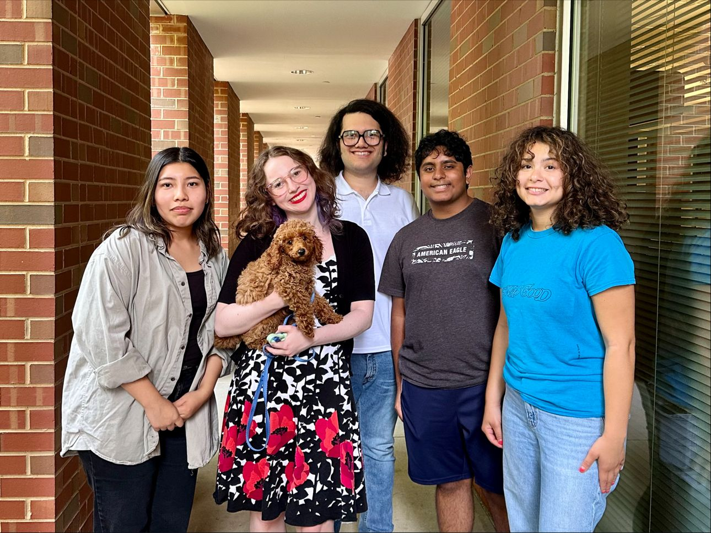

## Undergraduate Researchers

<figure style="max-width: 600px; margin: 0 auto 2rem;" class="text-center">
    
    <figcaption style="margin-top: 10px; font-style: italic; font-size: 0.9em;">Group Photo from Summer 2023: Yadhira Marcos-Avila, Heidi Reichert, myself, Shiva Gadireddy, and Samantha Gonzalez (from left to right)</figcaption>
</figure>



### {{ project_group.project }}

  
  

    

      
      
      
      

        <h5 class="card-title">
          
          <a href="{{ student.link }}" target="_blank" rel="noopener noreferrer">{{ student.name }}</a>
          
          {{ student.name }}
          
        </h5>
        <h6 class="card-subtitle mb-2 text-muted" style="font-size: 0.9rem;">{{ student.institution }}</h6>
        
<i class="fas fa-calendar pe-1"></i> {{ student.term }}

      

    

  

  



## Master's Students



### {{ project_group.project }}

  
  

    

      
      
      
      

        <h5 class="card-title">
          
          <a href="{{ student.link }}" target="_blank" rel="noopener noreferrer">{{ student.name }}</a>
          
          {{ student.name }}
          
        </h5>
        <h6 class="card-subtitle mb-2 text-muted" style="font-size: 0.9rem;">{{ student.institution }}</h6>
        
<i class="fas fa-calendar pe-1"></i> {{ student.term }}

      

    

  

  



## Teacher Research Interns



### {{ project_group.project }}

  
  

    

      
      
      
      

        <h5 class="card-title">
          
          <a href="{{ student.link }}" target="_blank" rel="noopener noreferrer">{{ student.name }}</a>
          
          {{ student.name }}
          
        </h5>
        <h6 class="card-subtitle mb-2 text-muted" style="font-size: 0.9rem;">{{ student.institution }}</h6>
        
<i class="fas fa-calendar pe-1"></i> {{ student.term }}

      

    

  

  


