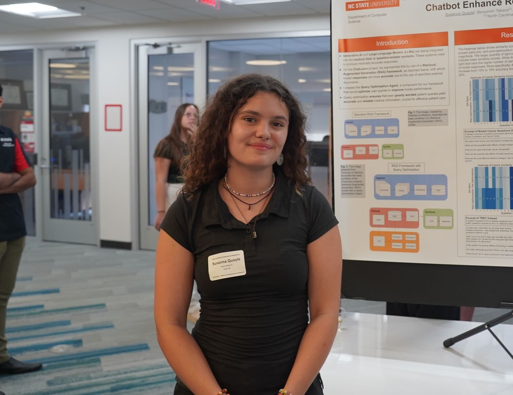
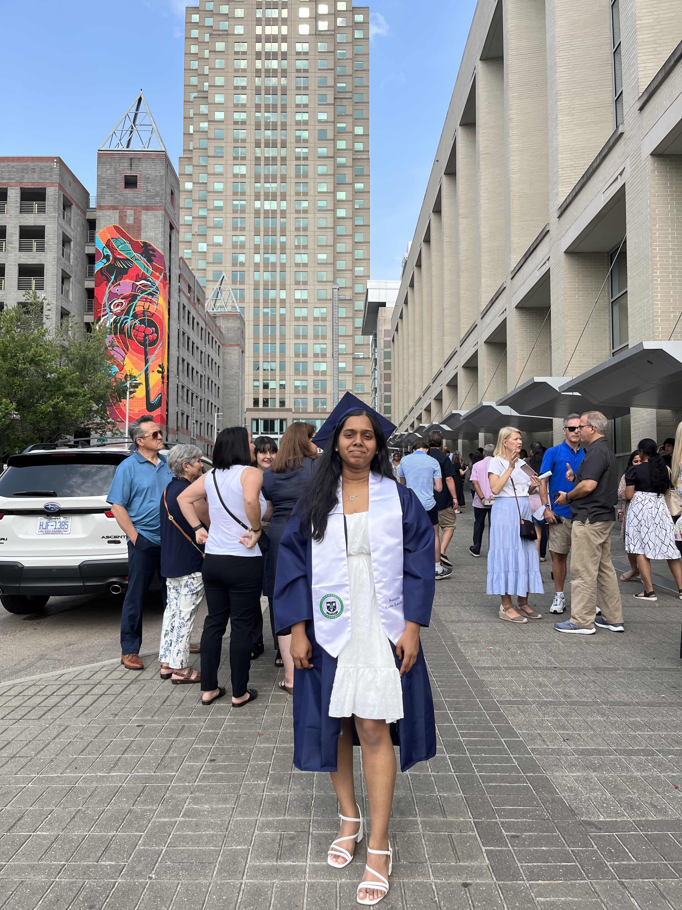
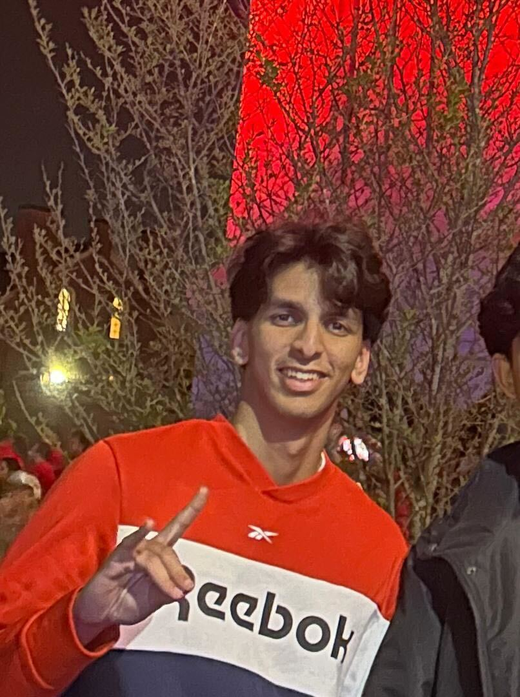
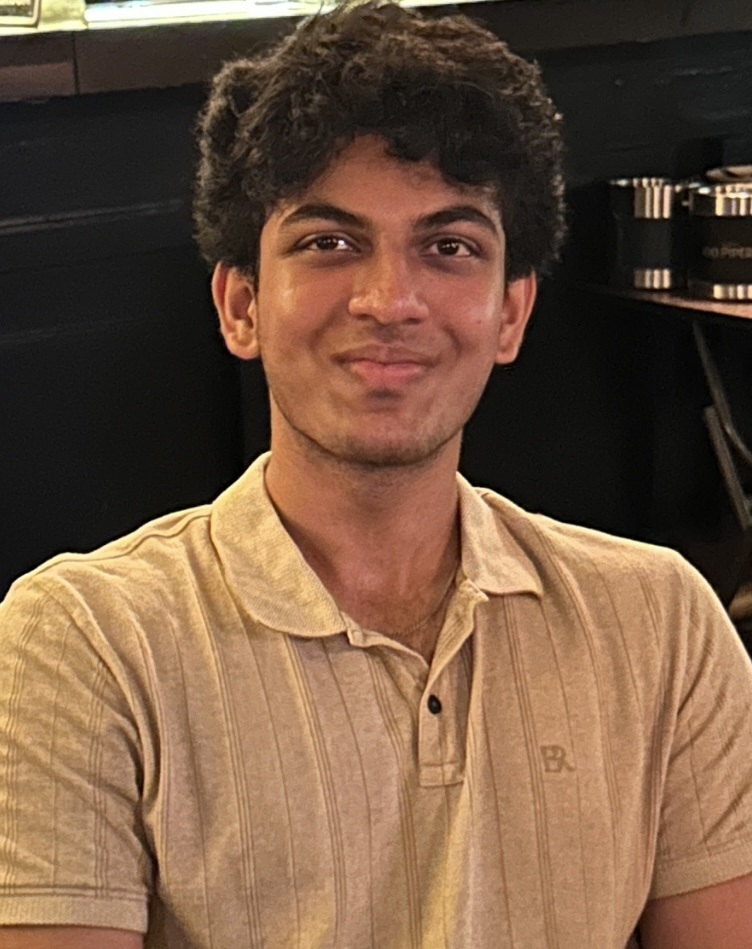
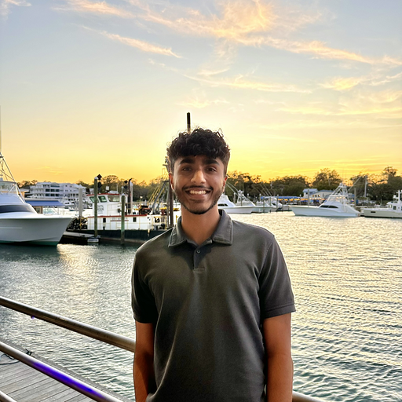
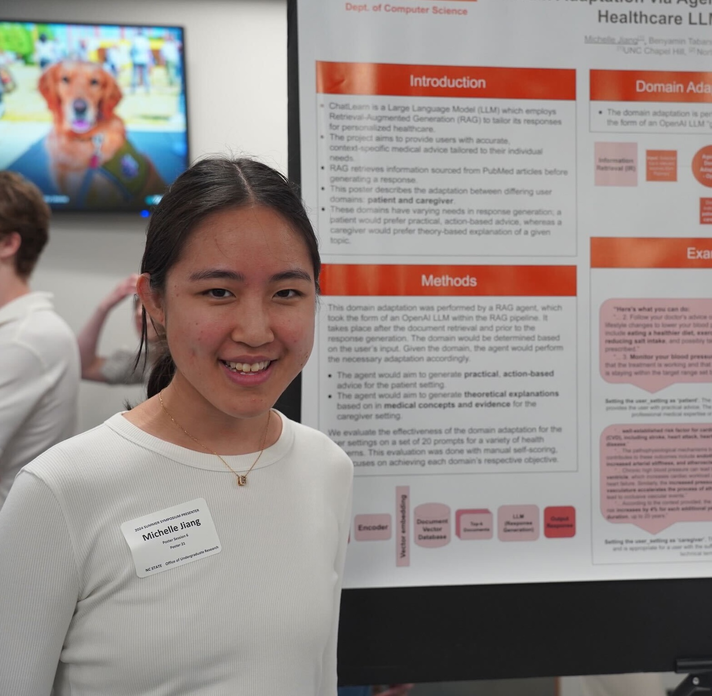
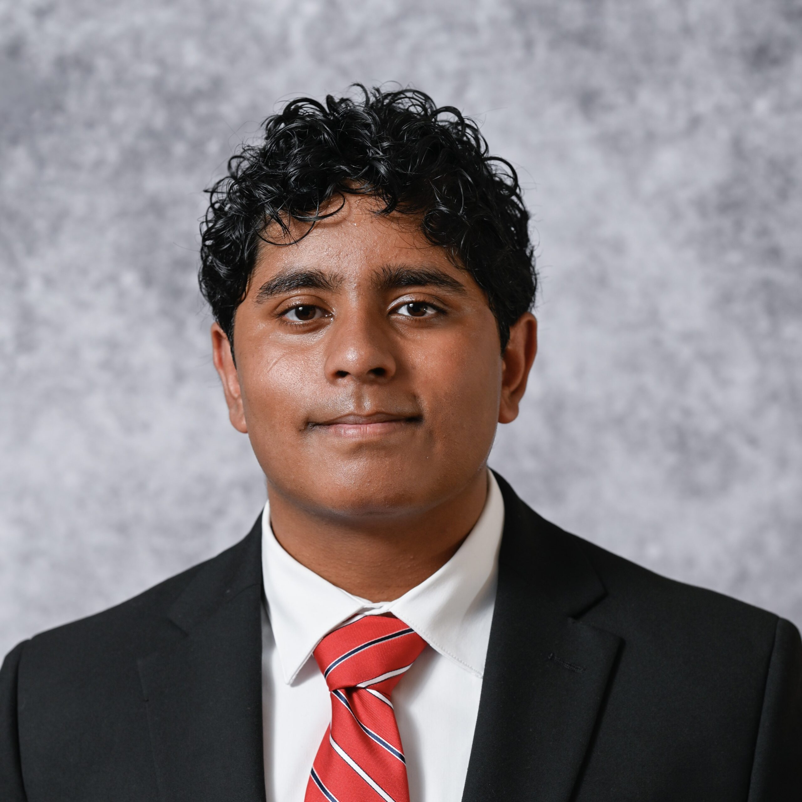
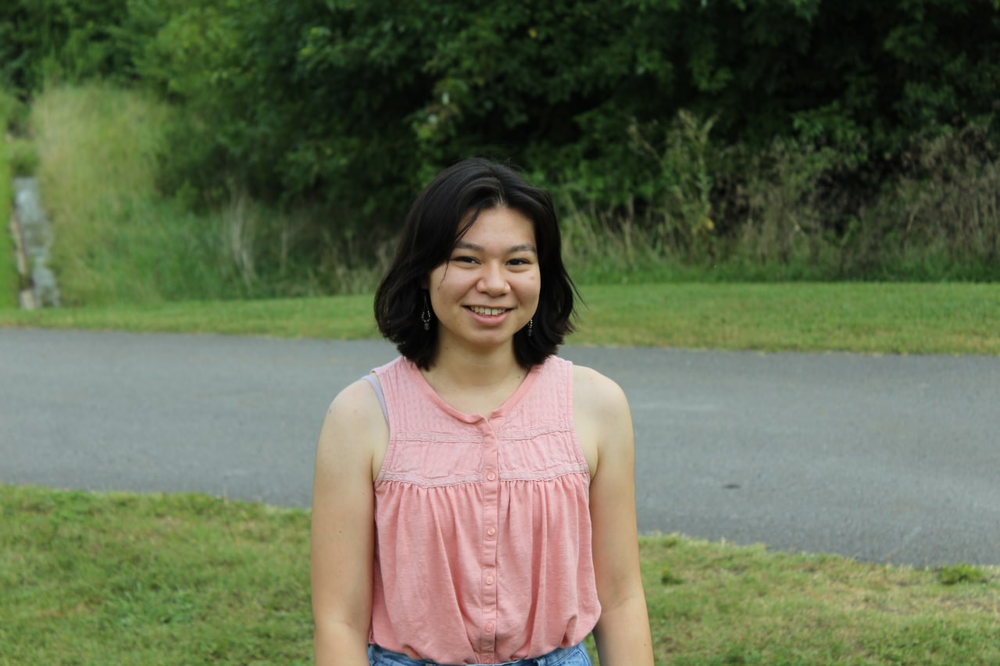

## Undergraduate Researchers

<figure style="max-width: 500px">
    
    <figcaption style="margin-top: 10px; font-style: italic; font-size: 0.8em;">Group Photo from Summer 2023: Yadhira Marcos-Avila, Heidi Reichert, myself, Shiva Gadireddy, and Samantha Gonzalez (from left to right)</figcaption>
</figure>

### MerryBench

1. **Jayani Sivakumar**  
   North Carolina State University, NC, USA, Summer 2025

2. **Susanna Quayle**  
   Fayetteville Technical Community College, NC, USA, Spring 2025 and Summer 2025
    

### MerryQuery

1. **Daniel Briceno**  
   North Carolina State University, NC, USA, Spring 2026

2. **Aishwarya Radhakrishnan**  
   North Carolina State University, NC, USA, Summer 2024 and Fall 2024
    

3. **Praneel Magapu**  
   North Carolina State University, NC, USA, Summer 2024
    

4. **Aditya Basarkar**  
   North Carolina State University, NC, USA, Summer 2024

5. **Lavan Aditya**  
   North Carolina State University, NC, USA, Summer 2024
    

### SafeTalkCoach

1. **Ary Kumar (Aryan Santhosh Kumar)**  
   North Carolina State University, NC, USA, Fall 2024 and Spring 2025
    

2. **Michelle Jiang**  
   UNC Chapel Hill, NC, USA, Summer 2024
    

3. **Jonathan Hardwick**  
   Fayetteville Technical Community College, NC, USA, Summer 2024
    

4. **Susanna Quayle**  
   Fayetteville Technical Community College, NC, USA, Summer 2024

### Systematic Literature Review on LLMs and Computing Education

1. **[Shiva Gadireddy](https://www.linkedin.com/in/shiva-gadireddy)**  
   North Carolina State University, NC, USA, Summer 2023, Fall 2023, and Spring 2024  
    

2. **Lavan Aditya**  
   North Carolina State University, NC, USA, Spring 2024

3. **[Samantha Gonzalez](https://www.linkedin.com/in/samantha-gonzalez-568183209)**  
   Kean University, NJ, USA, Summer 2023

4. **[Yadhira Marcos-Avila](https://www.linkedin.com/in/yadhira-marcos)**  
   UNC Charlotte, NC, USA, Summer 2023

### Detectors for Identifying Novices' Struggle during Programming

1. **[Rachel Qualls](https://www.linkedin.com/in/rachel-qualls/)**  
   University of Alabama, AL, USA, Summer 2022  
    

### Participatory Design on a Block-Based Programming Learning Management System (SnapClass)

1. **[Maggie Lin](https://www.linkedin.com/in/maggie-l-507104233/)**  
   North Carolina State University, NC, USA, Summer 2022

2. **[Sana Mahmoud](https://www.linkedin.com/in/sana-mahmoud/)**  
   North Carolina State University, NC, USA, Summer 2022

---

## Master's Students

### MerryQuery

1. **Shreyas Visweshwaran**  
   North Carolina State University, NC, USA, Fall 2025

2. **Teddy Chen**  
   North Carolina State University, NC, USA, Fall 2024

3. **Homak Patel**  
   North Carolina State University, NC, USA, Fall 2024

---

## Teacher Research Interns

### Integrating LLMs into K-12 Classrooms

1. **Cherri Fennel**  
   Durham Public Schools, NC, USA, Summer 2023

2. **Matthew Lococo**  
   Greene County School, NC, USA, Summer 2023
