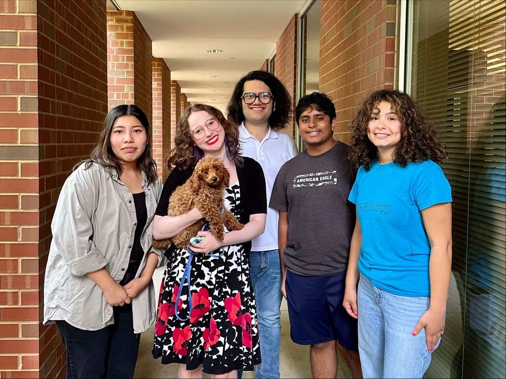
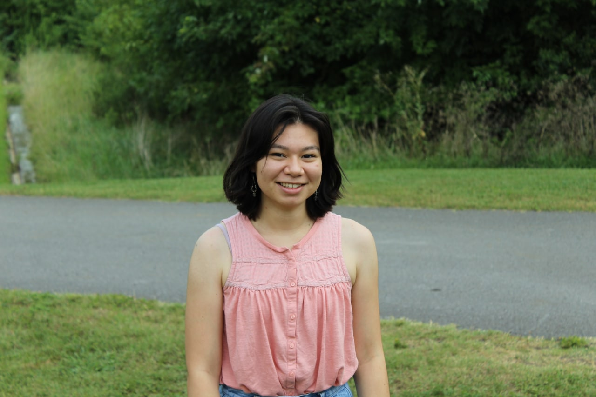

## Undergraduate Researchers

<figure style="max-width: 500px">
    
    <figcaption style="margin-top: 10px; font-style: italic; font-size: 0.8em;">Group Photo from Summer 2023: Yadhira Marcos-Avila, Heidi Reichert, myself, Shiva Gadireddy, and Samantha Gonzalez (from left to right)</figcaption>
</figure>

1. **Aishwarya Radhakrishnan**  
   North Carolina State University, NC, USA, Summer 2024 and Fall 2024  

2. **Michelle Jiang**  
   UNC Chapel Hill, NC, USA, Summer 2024  

3. **Jonathan Hardwick**  
   Fayetteville Technical Community College, NC, USA, Summer 2024  

4. **Susanna Quayle**  
   Fayetteville Technical Community College, NC, USA, Summer 2024  

5. **Praneel Magapu**  
   North Carolina State University, NC, USA, Summer 2024  

6. **Aditya Basarkar**  
   North Carolina State University, NC, USA, Summer 2024  

7. **Lavan Aditya**  
   North Carolina State University, NC, USA, Spring 2024 and Summer 2024  

8. **[Shiva Gadireddy](https://www.linkedin.com/in/shiva-gadireddy)**  
   North Carolina State University, NC, USA, Summer 2023, Fall 2023, and Spring 2024  
   Rising Junior, Computer Science  
   **Project:** Systematic Literature Review on the Use of Large Language Models in Education and Teachers' Workshop on Integrating LLMs into Classroom  
   

9. **[Samantha Gonzalez](https://www.linkedin.com/in/samantha-gonzalez-568183209)**  
   Kean University, NJ, USA, Summer 2023  
   Rising Junior, Computer Science  
   **Project:** Systematic Literature Review on the Use of Large Language Models in Education and Teachers' Workshop on Integrating LLMs into Classroom  

10. **[Yadhira Marcos-Avila](https://www.linkedin.com/in/yadhira-marcos)**  
    UNC Charlotte, NC, USA, Summer 2023  
    Rising Junior, Computer Science  
    **Project:** Systematic Literature Review on the Use of Large Language Models in Education and Teachers' Workshop on Integrating LLMs into Classroom  

11. **[Rachel Qualls](https://www.linkedin.com/in/rachel-qualls/)**  
    University of Alabama, AL, USA, Summer 2022  
    Rising Junior, Computer Science and Math  
    **Project:** Detectors for Identifying Novices' Struggle during Programming [paper](https://www.researchgate.net/profile/Benyamin-Tabarsi/publication/363052760)  
    

12. **[Maggie Lin](https://www.linkedin.com/in/maggie-l-507104233/)**  
    North Carolina State University, NC, USA, Summer 2022  
    Rising Sophomore, Computer Science  
    **Project:** Participatory Design on a Blocked-Based Programming Learning Management System (SnapClass)

13. **[Sana Mahmoud](https://www.linkedin.com/in/sana-mahmoud/)**  
    North Carolina State University, NC, USA, Summer 2022  
    Rising Junior, Computer Science  
    **Project:** Participatory Design on a Blocked-Based Programming Learning Management System (SnapClass)

## K-12 Teachers

1. **Cherri Fennel**  
   Durham Public Schools, NC, USA, Summer 2023  

2. **Matthew Lococo**  
   Greene County School, NC, USA, Summer 2023  
